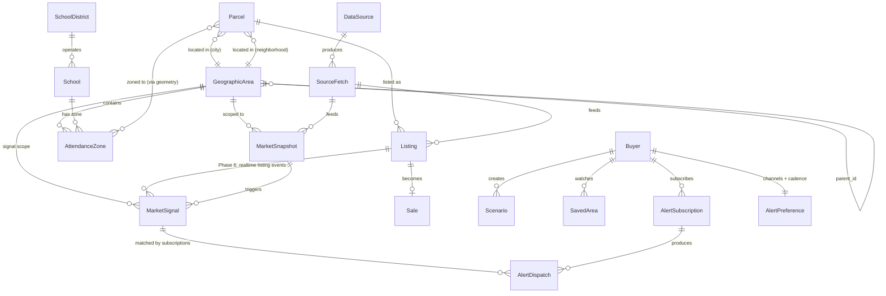

# Data Model

> Status: Draft v1 · Owner: project lead · Last updated: 2026-05-10
> Read `requirements.md` first for context on what these entities serve. Implementation strategy is in `design.md`.

---

## 1. Design tenets

These constrain entity design throughout this doc.

1. **Polymorphic geographic areas.** Cities, neighborhoods, ZIPs, school zones, and arbitrary user polygons are all "areas you can compute stats over." One table with a `kind` discriminator + PostGIS geometry serves all of them.
2. **Parcel-as-stable, listing-as-event.** A house has one parcel and many listings over its life. Tax/HOA/Mello-Roos belong to the parcel; price/DOM belong to the listing.
3. **Pre-computed snapshots, not query-time aggregation.** `MarketSnapshot` is materialized by ETL. The serving path never computes medians from raw sales — that scales linearly with traffic and breaks at month six.
4. **Versioned attendance zones.** School zones change every 3–7 years. The `effective_from` / `effective_to` columns let "this house was zoned to MSJ in 2024" remain queryable forever.
5. **Bronze / Silver / Gold separation.** Raw payloads are immutable; cleaned data is rebuildable; serving data is indexed for query speed. Never throw away Bronze.
6. **Soft denormalization where it pays.** Parcels carry `city_id` and `neighborhood_id` directly even though they're spatially derivable, because the spatial join is too expensive on the hot path.

---

## 2. Entity-relationship overview



---

## 3. Geographic & administrative entities

### 3.1 `GeographicArea` — the polymorphic spine

```sql
CREATE TABLE geographic_area (
  id              UUID PRIMARY KEY DEFAULT gen_random_uuid(),
  kind            geo_kind NOT NULL,           -- enum
  name            TEXT NOT NULL,
  slug            TEXT NOT NULL,                -- url-safe; unique per (kind, parent)
  parent_id       UUID REFERENCES geographic_area(id),
  metro_id        UUID REFERENCES geographic_area(id),  -- denormalized: nearest ancestor where kind='metro'
  geometry        geometry(MultiPolygon, 4326) NOT NULL,
  centroid        geometry(Point, 4326) GENERATED ALWAYS AS (ST_Centroid(geometry)) STORED,
  area_sqkm       NUMERIC GENERATED ALWAYS AS (ST_Area(geometry::geography) / 1e6) STORED,
  population      INTEGER,
  median_household_income NUMERIC,
  metadata        JSONB NOT NULL DEFAULT '{}',
  source          TEXT,                         -- 'tiger_2024', 'cde_2025', etc.
  effective_from  DATE,
  effective_to    DATE,
  created_at      TIMESTAMPTZ NOT NULL DEFAULT now(),

  UNIQUE (kind, parent_id, slug)
);

CREATE TYPE geo_kind AS ENUM (
  'metro', 'county', 'city', 'neighborhood', 'zip',
  'school_zone', 'school_district', 'custom_polygon'
);

CREATE INDEX idx_geo_geom ON geographic_area USING GIST (geometry);
CREATE INDEX idx_geo_centroid ON geographic_area USING GIST (centroid);
CREATE INDEX idx_geo_kind_metro ON geographic_area (metro_id, kind);
CREATE INDEX idx_geo_parent ON geographic_area (parent_id);
```

**Why this shape:**

- One table for all area-like things means one snapshot pipeline serves all of them (Section 6).
- `parent_id` is a *navigation* hierarchy (county → city → neighborhood) but not a *geometric* one — a school zone may not nest cleanly in a city. Spatial relationships use PostGIS `ST_Within` / `ST_Intersects`, not `parent_id`.
- `metro_id` is denormalized so "give me everything in the Bay Area" is a single indexed scan.
- `effective_from/to` lets boundaries be versioned (city annexations, school-zone redraws). NULL `effective_to` means "current."
- `metadata` is for kind-specific extras: school zones store `{school_id, level}`, ZIPs store `{zcta_type}`, neighborhoods store `{source: "redfin" | "zillow" | "user"}`.

**Indexing notes:**

- GIST on `geometry` is non-negotiable; almost every spatial query depends on it.
- Composite `(metro_id, kind)` covers "show me all cities in Bay Area" — the most common nav query.

### 3.2 Examples of polymorphic use

| `kind` | `parent_id` | `metadata` | Example |
|--------|-------------|------------|---------|
| metro | NULL | `{}` | Bay Area |
| county | metro_id | `{fips: "06001"}` | Alameda County |
| city | county_id | `{}` | Fremont |
| neighborhood | city_id | `{source: "redfin"}` | Mission San Jose |
| zip | metro_id | `{zcta: "94539"}` | 94539 |
| school_zone | city_id (best-fit) | `{school_id, level: "high"}` | Mission San Jose HS attendance area |
| school_district | county_id | `{cdscode: "..."}` | Fremont Unified School District |
| custom_polygon | NULL | `{user_id, label: "my commute target"}` | User-drawn shape |

---

## 4. School entities

### 4.1 `SchoolDistrict`

```sql
CREATE TABLE school_district (
  id              UUID PRIMARY KEY DEFAULT gen_random_uuid(),
  cds_code        TEXT UNIQUE,                  -- CA Dept of Education code
  name            TEXT NOT NULL,
  area_id         UUID NOT NULL REFERENCES geographic_area(id),  -- kind='school_district'
  total_enrollment INTEGER,
  per_pupil_spending NUMERIC,
  metadata        JSONB NOT NULL DEFAULT '{}'
);
```

`area_id` points to a `GeographicArea` of kind `school_district` — that's where the boundary geometry lives. Keeping geometry on `GeographicArea` (not on `SchoolDistrict`) is what enables the polymorphic snapshot pipeline.

### 4.2 `School`

```sql
CREATE TABLE school (
  id              UUID PRIMARY KEY DEFAULT gen_random_uuid(),
  district_id     UUID NOT NULL REFERENCES school_district(id),
  cds_code        TEXT UNIQUE,
  name            TEXT NOT NULL,
  level           school_level NOT NULL,        -- 'elementary' | 'middle' | 'high' | 'k12'
  grades          INT4RANGE,                    -- e.g. '[9,12]'
  address         TEXT,
  location        geometry(Point, 4326),
  enrollment      INTEGER,
  student_teacher_ratio NUMERIC,
  ratings         JSONB NOT NULL DEFAULT '{}',  -- {greatschools, niche, test_scores: {...}, year}
  data_quality_score SMALLINT,                  -- 0-100
  feeder_pattern  JSONB,                        -- {feeds_into: [school_id, ...]}
  updated_at      TIMESTAMPTZ NOT NULL DEFAULT now()
);

CREATE INDEX idx_school_district ON school (district_id);
CREATE INDEX idx_school_loc ON school USING GIST (location);
```

`ratings` as JSONB because every source has a different shape and we want to preserve all of them rather than collapse to a single number — see requirements F-GEO-08 (multiple ratings shown side by side).

### 4.3 `AttendanceZone` — the temporally-versioned bit

```sql
CREATE TABLE attendance_zone (
  id              UUID PRIMARY KEY DEFAULT gen_random_uuid(),
  school_id       UUID NOT NULL REFERENCES school(id),
  area_id         UUID NOT NULL REFERENCES geographic_area(id),  -- kind='school_zone'
  effective_from  DATE NOT NULL,
  effective_to    DATE,                         -- NULL = current
  source_url      TEXT,
  source_doc      TEXT,                         -- e.g. board resolution number
  notes           TEXT,
  created_at      TIMESTAMPTZ NOT NULL DEFAULT now(),

  EXCLUDE USING GIST (
    school_id WITH =,
    daterange(effective_from, effective_to, '[)') WITH &&
  )
);
```

Key choices:

- The `EXCLUDE` constraint prevents two overlapping current zones for the same school — protects against bad ingest data.
- Geometry lives on the linked `GeographicArea`, not here, so zone boundaries can be versioned cleanly (each version is a new GeographicArea row).
- A house's "what zone am I in" question for a given date becomes: spatial-join on parcel point, filter by `effective_from/to`. Query example in Section 11.

---

## 5. Property & transaction entities

### 5.1 `Parcel`

```sql
CREATE TABLE parcel (
  id              UUID PRIMARY KEY DEFAULT gen_random_uuid(),
  apn             TEXT NOT NULL,                -- assessor's parcel number
  county_id       UUID NOT NULL REFERENCES geographic_area(id),
  address         TEXT,
  location        geometry(Point, 4326) NOT NULL,
  lot_sqft        INTEGER,
  zoning          TEXT,
  city_id         UUID REFERENCES geographic_area(id),    -- denormalized
  neighborhood_id UUID REFERENCES geographic_area(id),    -- denormalized
  -- Tax + special assessments
  base_assessed_value NUMERIC,
  base_year       INTEGER,                      -- Prop 13 anchor
  current_tax_rate NUMERIC,                     -- 1.x% typical
  mello_roos      JSONB,                        -- {active, annual, expires, district_name}
  hoa             JSONB,                        -- {exists, monthly, name}
  ada_features    JSONB,
  raw_assessor    JSONB,                        -- preserve full record
  source          TEXT,
  updated_at      TIMESTAMPTZ NOT NULL DEFAULT now(),

  UNIQUE (county_id, apn)
);

CREATE INDEX idx_parcel_loc ON parcel USING GIST (location);
CREATE INDEX idx_parcel_city ON parcel (city_id);
CREATE INDEX idx_parcel_neighborhood ON parcel (neighborhood_id);
```

`apn` is unique only within a county — that's how California numbers them. The composite unique key reflects that. Denormalizing `city_id`/`neighborhood_id` saves a spatial join on every parcel-detail query; cost is having to update them when boundaries change (rare, batch job).

### 5.2 `Listing`

```sql
CREATE TABLE listing (
  id                UUID PRIMARY KEY DEFAULT gen_random_uuid(),
  parcel_id         UUID REFERENCES parcel(id),    -- nullable: sometimes we have a listing before parcel match
  source            TEXT NOT NULL,                  -- 'redfin', 'mls_bridge', etc.
  source_listing_id TEXT NOT NULL,
  status            listing_status NOT NULL,
  property_type     property_type NOT NULL,         -- enum
  list_price        NUMERIC,
  sold_price        NUMERIC,
  list_date         DATE,
  pending_date      DATE,
  sold_date         DATE,
  off_market_date   DATE,
  beds              SMALLINT,
  baths             NUMERIC,                        -- '2.5' baths
  sqft              INTEGER,
  year_built        SMALLINT,
  days_on_market    INTEGER,
  price_drops       JSONB,                          -- [{date, from, to}, ...]
  raw_payload       JSONB,                          -- entire source record
  fetched_at        TIMESTAMPTZ NOT NULL,

  UNIQUE (source, source_listing_id)
);

CREATE TYPE listing_status AS ENUM
  ('active', 'pending', 'sold', 'withdrawn', 'expired', 'unknown');

CREATE TYPE property_type AS ENUM
  ('sfh', 'condo', 'townhome', 'multifamily', 'land', 'mobile', 'other');

CREATE INDEX idx_listing_parcel ON listing (parcel_id);
CREATE INDEX idx_listing_status_sold ON listing (sold_date) WHERE status = 'sold';
CREATE INDEX idx_listing_active ON listing (status) WHERE status = 'active';
```

`raw_payload` preservation is non-negotiable — when a source changes their schema, we re-derive Silver from Bronze without re-fetching.

### 5.3 `Sale` (materialized view)

```sql
CREATE MATERIALIZED VIEW sale AS
SELECT
  l.id AS listing_id,
  l.parcel_id,
  l.sold_date,
  l.sold_price,
  l.list_price,
  l.sold_price / NULLIF(l.list_price, 0) AS sale_to_list,
  l.days_on_market,
  l.property_type,
  l.beds, l.baths, l.sqft,
  l.sold_price / NULLIF(l.sqft, 0) AS price_per_sqft,
  p.city_id, p.neighborhood_id, p.county_id, p.location
FROM listing l
LEFT JOIN parcel p ON p.id = l.parcel_id
WHERE l.status = 'sold' AND l.sold_date IS NOT NULL;

CREATE UNIQUE INDEX idx_sale_listing ON sale (listing_id);
CREATE INDEX idx_sale_date ON sale (sold_date);
CREATE INDEX idx_sale_city_date ON sale (city_id, sold_date);
CREATE INDEX idx_sale_loc ON sale USING GIST (location);
```

Refreshed nightly after ETL. The reason to materialize: this is the input to every snapshot computation, and the `LEFT JOIN parcel` is expensive at scale.

---

## 6. The aggregation table — `MarketSnapshot`

This is the table that makes everything scale. **Any** GeographicArea can have snapshots — Fremont city, MSJ HS attendance zone, ZIP 94539, a user-drawn commute polygon. One table, one aggregator, one query pattern. All area pages render directly from this.

```sql
CREATE TABLE market_snapshot (
  id              UUID PRIMARY KEY DEFAULT gen_random_uuid(),
  area_id         UUID NOT NULL REFERENCES geographic_area(id),
  property_type   property_type NOT NULL,
  period_kind     period_kind NOT NULL,         -- 'weekly' | 'monthly' | 'quarterly' | 'yearly'
  period_start    DATE NOT NULL,
  period_end      DATE NOT NULL,

  -- Core stats
  median_sale_price       NUMERIC,
  median_list_price       NUMERIC,
  median_ppsf             NUMERIC,
  sale_to_list_ratio      NUMERIC,
  pct_sold_over_asking    NUMERIC,
  median_dom              INTEGER,
  homes_sold              INTEGER,
  active_listings         INTEGER,
  new_listings            INTEGER,
  pending_sales           INTEGER,
  months_of_supply        NUMERIC,
  pct_with_price_drops    NUMERIC,
  median_drop_pct         NUMERIC,
  median_size_sqft        INTEGER,
  median_year_built       SMALLINT,

  -- Breakouts (jsonb so we can add buckets without migrations)
  by_bedrooms     JSONB,                        -- {"2": {median, count}, "3": ..., "4+": ...}
  percentiles     JSONB,                        -- {"p10": ..., "p25": ..., "p75": ..., "p90": ...}

  -- Provenance
  sample_size       INTEGER NOT NULL,
  confidence_score  SMALLINT NOT NULL,          -- 0-100
  source_versions   JSONB NOT NULL,             -- {redfin_csv: "2026-w18", ...}
  computed_at       TIMESTAMPTZ NOT NULL DEFAULT now(),

  UNIQUE (area_id, property_type, period_kind, period_start)
);

CREATE TYPE period_kind AS ENUM ('weekly', 'monthly', 'quarterly', 'yearly');

-- Most queries hit (area, type, period) — covers 90% of read patterns
CREATE INDEX idx_snapshot_lookup
  ON market_snapshot (area_id, property_type, period_kind, period_start DESC);

-- Time-series chart query
CREATE INDEX idx_snapshot_timeseries
  ON market_snapshot (area_id, property_type, period_kind, period_start);
```

**Partitioning:** When the table reaches ~50M rows (probably year three), partition by `period_start` (yearly). Use `pg_partman` to automate. Until then, indexes are enough.

**Why `JSONB` for `by_bedrooms` and `percentiles`:** keeps the schema stable when we want to add 5+ bedrooms or new percentile cuts. The trade-off is we can't index inside them — fine, because nothing aggregates *across* snapshots on these fields.

**Confidence score formula** (deterministic, in `packages/finance/`):

```
confidence = clamp(0, 100,
  base                     # 100 if sample_size >= threshold
  - max(0, days_stale - 14)        # decay 1pt/day after 2 weeks
  - min(40, 100 / sqrt(sample_size))  # small-sample penalty
)
```

Threshold table per metric is defined in `design.md` (TBD from persona-review follow-up).

---

## 6a. Market Phase classification (per requirements F-TIM-02)

Market Phase is computed from each `MarketSnapshot` (formula in `design.md` §5.3.1) and stored as a column on the snapshot row. Storing it (vs. computing on read) is an explicit choice — phase transitions need to be **detectable by SQL** so the signal pipeline (§6b) can fire on insert.

```sql
ALTER TABLE market_snapshot
  ADD COLUMN phase market_phase,
  ADD COLUMN clock_position NUMERIC,        -- 0.0–12.0 continuous
  ADD COLUMN buyer_pressure SMALLINT,       -- 0–100
  ADD COLUMN seller_pressure SMALLINT,      -- 0–100
  ADD COLUMN phase_components JSONB;        -- {mos, s2l_4w, s2l_12w, pdrop, dom_trend, inv_yoy}

CREATE TYPE market_phase AS ENUM ('peak', 'cooling', 'trough', 'recovery', 'unknown');

-- Helper view: most recent phase per (area, property_type)
CREATE VIEW current_market_phase AS
SELECT DISTINCT ON (area_id, property_type)
  area_id, property_type, period_start,
  phase, clock_position, buyer_pressure, seller_pressure, phase_components,
  confidence_score
FROM market_snapshot
WHERE period_kind = 'weekly'
ORDER BY area_id, property_type, period_start DESC;
```

Phase = `'unknown'` when sample size or confidence is too low for reliable classification.

---

## 6b. `MarketSignal` — append-only event log

Every snapshot recompute emits zero or more signals. This is the single audit log behind both the user "what changed" feed (F-RT-05) and the alert pipeline (`design.md` §4.4).

```sql
CREATE TABLE market_signal (
  id              BIGSERIAL PRIMARY KEY,           -- monotonic, mirrors RESO EntityEventSequence pattern
  area_id         UUID NOT NULL REFERENCES geographic_area(id),
  property_type   property_type,                    -- nullable for non-typed signals (rate, etc.)
  kind            signal_kind NOT NULL,
  severity        SMALLINT NOT NULL,                -- 1 (info) – 5 (critical)
  payload         JSONB NOT NULL,                   -- shape varies by kind; see below
  source_snapshot_ids UUID[] NOT NULL,              -- which snapshot rows triggered this
  source_fetch_ids    UUID[],                       -- raw provenance
  computed_at     TIMESTAMPTZ NOT NULL DEFAULT now(),
  -- For Phase 6 MLS slot-in:
  source_listing_id UUID REFERENCES listing(id),

  -- Idempotency: same signal kind+payload for same area+day shouldn't double-insert
  UNIQUE (area_id, kind, (payload->>'dedupe_key'), (computed_at::date))
);

CREATE TYPE signal_kind AS ENUM (
  -- Phase 2+ (computed from snapshots)
  'phase_transition',          -- payload: {from_phase, to_phase, trigger_components}
  'mos_threshold',             -- payload: {direction, value, threshold: 3.0}
  's2l_threshold',             -- payload: {direction, value, threshold: 1.0}
  'dom_threshold',             -- payload: {direction, value, delta_d}
  'inventory_spike',           -- payload: {yoy_pct}
  'price_drop_pct',            -- payload: {pct_listings_w_drops, median_drop}
  -- Phase 2+ (rate)
  'rate_threshold',            -- payload: {direction, current_rate, threshold}
  -- Phase 6 (MLS realtime)
  'new_listing',               -- payload: {listing_id, list_price, beds, sqft, ...}
  'price_change',              -- payload: {listing_id, from, to, pct}
  'status_flip',               -- payload: {listing_id, from_status, to_status}
  'sold'                       -- payload: {listing_id, sold_price, dom}
);

-- Hot path: "give me the last N signals for areas X, Y, Z" (the "what changed" feed)
CREATE INDEX idx_signal_area_time ON market_signal (area_id, computed_at DESC);

-- Alert matching: "find all signals since sequence N"
CREATE INDEX idx_signal_seq ON market_signal (id);

-- Per-kind queries
CREATE INDEX idx_signal_kind_time ON market_signal (kind, computed_at DESC);
```

**Why `BIGSERIAL`** (not UUID): mirrors RESO's [EntityEventSequence](https://www.reso.org/blog/entityevent-resource/) — monotonic ordering matters for cursor-based subscription replay, and `WHERE id > :last_seen` is faster than timestamp ranges (no clock-drift concerns).

**Phase 6 slot-in:** the MLS adapter inserts rows of kind `new_listing` / `price_change` / `status_flip` / `sold` with `source_listing_id` populated. Alert evaluation, dispatch, and "what changed" UI need zero changes.

---

## 7. Source provenance

### 7.1 `DataSource`

```sql
CREATE TABLE data_source (
  id              UUID PRIMARY KEY DEFAULT gen_random_uuid(),
  name            TEXT UNIQUE NOT NULL,         -- 'redfin_csv', 'greatschools', 'alameda_assessor'
  display_name    TEXT NOT NULL,
  attribution     TEXT NOT NULL,
  license         TEXT NOT NULL,                -- 'attribution', 'commercial', 'public_domain'
  base_url        TEXT,
  reliability     JSONB NOT NULL,               -- {capability: 0.0-1.0}
  is_active       BOOLEAN NOT NULL DEFAULT true,
  added_at        DATE NOT NULL,
  notes           TEXT
);
```

`reliability` lets the resolver pick the best source per (area, capability):

```json
{
  "median_price": 0.95,
  "inventory": 0.90,
  "school_zone_split": 0.40,
  "ppsf": 0.85
}
```

### 7.2 `SourceFetch` — every fetch logged

```sql
CREATE TABLE source_fetch (
  id              UUID PRIMARY KEY DEFAULT gen_random_uuid(),
  source_id       UUID NOT NULL REFERENCES data_source(id),
  area_id         UUID REFERENCES geographic_area(id),
  fetched_at      TIMESTAMPTZ NOT NULL DEFAULT now(),
  status          TEXT NOT NULL,                -- 'success', 'parse_error', 'http_error', 'blocked'
  http_status     INTEGER,
  payload_uri     TEXT,                         -- s3://bayre-bronze/...
  payload_bytes   INTEGER,
  rows_parsed     INTEGER,
  parse_anomalies JSONB,                        -- [{field, expected, got}, ...]
  duration_ms     INTEGER,
  error           TEXT
);

CREATE INDEX idx_fetch_source_time ON source_fetch (source_id, fetched_at DESC);
CREATE INDEX idx_fetch_area_time ON source_fetch (area_id, fetched_at DESC);
```

Every snapshot's `source_versions` JSONB references SourceFetch IDs. This closes the loop: any number on the dashboard → snapshot → fetch → raw bytes in S3.

---

## 8. Buyer & personalization entities

### 8.1 `Buyer` (account)

```sql
CREATE TABLE buyer (
  id              UUID PRIMARY KEY DEFAULT gen_random_uuid(),
  email           CITEXT UNIQUE NOT NULL,
  email_verified  BOOLEAN NOT NULL DEFAULT false,
  display_name    TEXT,
  -- Financial profile (encrypted column-level via pgcrypto)
  household_income_enc BYTEA,
  base_income_enc      BYTEA,
  bonus_income_enc     BYTEA,
  rsu_income_enc       BYTEA,
  monthly_debt_enc     BYTEA,
  liquid_savings_enc   BYTEA,
  credit_score_band TEXT,                       -- not exact score
  -- Household
  household_size  SMALLINT,
  kids_ages       SMALLINT[],
  current_rent    INTEGER,                      -- needed for rent-vs-buy
  timeline_months INTEGER,
  -- Audit
  created_at      TIMESTAMPTZ NOT NULL DEFAULT now(),
  updated_at      TIMESTAMPTZ NOT NULL DEFAULT now(),
  last_login_at   TIMESTAMPTZ,
  deleted_at      TIMESTAMPTZ                   -- soft delete; purge job after 30 days
);
```

Income/debt/savings are encrypted at the column level (pgcrypto) per requirement NF-SEC-01. `credit_score_band` (e.g., '740-779') is stored in the clear because we never need exact scores for FTHB calcs.

### 8.2 `Scenario`

```sql
CREATE TABLE scenario (
  id              UUID PRIMARY KEY DEFAULT gen_random_uuid(),
  buyer_id        UUID NOT NULL REFERENCES buyer(id) ON DELETE CASCADE,
  name            TEXT NOT NULL,                -- "Now", "If rates drop to 6%", ...
  target_areas    UUID[] NOT NULL,              -- references geographic_area(id)
  property_type_pref TEXT[] NOT NULL,           -- ['sfh', 'townhome']
  must_haves      JSONB NOT NULL DEFAULT '{}',  -- {min_school_rating, max_commute_min, beds_min, ...}
  nice_to_haves   JSONB NOT NULL DEFAULT '{}',  -- weighted: {school: 0.4, commute: 0.3, ...}
  financial       JSONB NOT NULL,               -- {rate, term_years, down_pct, closing_pct, appreciation: {low, base, high}}
  notes           TEXT,
  created_at      TIMESTAMPTZ NOT NULL DEFAULT now(),
  updated_at      TIMESTAMPTZ NOT NULL DEFAULT now()
);
```

`Scenario` (not "preferences") is the unit of saved work — buyers compare scenarios, e.g., "what if rates drop?" vs. "what if we push to $200K down?"

### 8.3 `SavedArea`, `AlertSubscription`, `AlertDispatch`

The original `alert` table conflated subscription (what the user wants) with dispatch (what was sent). Splitting them lets us track open/click funnels and dedupe correctly.

```sql
CREATE TABLE saved_area (
  buyer_id        UUID NOT NULL REFERENCES buyer(id) ON DELETE CASCADE,
  area_id         UUID NOT NULL REFERENCES geographic_area(id),
  feed_enabled    BOOLEAN NOT NULL DEFAULT true,    -- "what changed" feed visible
  added_at        TIMESTAMPTZ NOT NULL DEFAULT now(),
  PRIMARY KEY (buyer_id, area_id)
);

CREATE TABLE alert_subscription (
  id              UUID PRIMARY KEY DEFAULT gen_random_uuid(),
  buyer_id        UUID NOT NULL REFERENCES buyer(id) ON DELETE CASCADE,
  area_id         UUID REFERENCES geographic_area(id),    -- nullable: rate alerts are global
  scenario_id     UUID REFERENCES scenario(id),
  signal_kind     signal_kind NOT NULL,                    -- references signal_kind enum
  threshold_config JSONB NOT NULL,                         -- e.g. {dom_above: 25} or {rate_below: 6.0}
  channels        TEXT[] NOT NULL,                         -- {'in_app','email_immediate','email_daily','web_push'}
  dedupe_window_hours SMALLINT NOT NULL DEFAULT 24,        -- per F-RT-08
  snooze_until    TIMESTAMPTZ,                             -- per F-RT-09
  is_active       BOOLEAN NOT NULL DEFAULT true,
  created_at      TIMESTAMPTZ NOT NULL DEFAULT now(),
  updated_at      TIMESTAMPTZ NOT NULL DEFAULT now()
);

CREATE INDEX idx_subscription_match
  ON alert_subscription (signal_kind, area_id) WHERE is_active = true;
CREATE INDEX idx_subscription_buyer ON alert_subscription (buyer_id);

CREATE TABLE alert_dispatch (
  id              UUID PRIMARY KEY DEFAULT gen_random_uuid(),
  subscription_id UUID NOT NULL REFERENCES alert_subscription(id) ON DELETE CASCADE,
  signal_id       BIGINT NOT NULL REFERENCES market_signal(id),
  channel         TEXT NOT NULL,
  dispatched_at   TIMESTAMPTZ NOT NULL DEFAULT now(),
  delivered_at    TIMESTAMPTZ,
  opened_at       TIMESTAMPTZ,
  clicked_at      TIMESTAMPTZ,
  bounce_reason   TEXT,
  -- Per F-RT-08: dedupe is enforced at insert time
  UNIQUE (subscription_id, signal_id, channel)
);

CREATE INDEX idx_dispatch_subscription_time
  ON alert_dispatch (subscription_id, dispatched_at DESC);
CREATE INDEX idx_dispatch_funnel
  ON alert_dispatch (dispatched_at, channel);  -- for NF-OBS-05 funnel analysis

CREATE TABLE alert_preference (
  buyer_id        UUID PRIMARY KEY REFERENCES buyer(id) ON DELETE CASCADE,
  email_enabled   BOOLEAN NOT NULL DEFAULT true,
  push_enabled    BOOLEAN NOT NULL DEFAULT false,
  digest_cadence  TEXT NOT NULL DEFAULT 'immediate',  -- 'immediate', 'daily', 'weekly'
  digest_local_hour SMALLINT NOT NULL DEFAULT 8,      -- 0–23 in user's tz
  timezone        TEXT NOT NULL DEFAULT 'America/Los_Angeles',
  push_subscription_jsonb JSONB,                      -- VAPID web-push payload
  updated_at      TIMESTAMPTZ NOT NULL DEFAULT now()
);
```

**Why split subscription / dispatch:**

- Subscription is *intent* (long-lived; user edits).
- Dispatch is *fact* (short-lived row per send; drives funnel analytics per NF-OBS-05).
- Dedupe is enforced by the `UNIQUE (subscription_id, signal_id, channel)` constraint — can't double-send.
- Snooze is a single column on subscription; alert matcher checks `snooze_until > now()` before dispatching.

---

## 9. Computed values (not stored as entities)

These are pure functions over the entities above. They live in `packages/finance/` (Python with TS port) and are never persisted as columns. Re-computing on demand is cheap; storing them means cache invalidation on every input change.

| Function | Inputs | Output |
|----------|--------|--------|
| `affordability(income, debt, down, rate, term, county)` | Buyer financials + market context | `{comfortable, stretch, max_by_loan_type}` |
| `monthly_cost(price, area, scenario)` | Price + area (for tax rate, Mello-Roos, HOA est) | `{p_and_i, tax, mello, hoa, insurance, pmi, total}` |
| `tco(price, area, horizon, scenario)` | Price + area + 5/10/30y | `{total, equivalent_monthly, equity_built, tax_shield_used}` |
| `rent_vs_buy(price, rent, scenario)` | Price + rent + financial assumptions | `{breakeven_years, wealth_diff_5y, wealth_diff_10y}` |
| `school_premium(school_id, period)` | School + comparison area | `{premium_pct, premium_dollars, sample_size}` |
| `area_fit_score(scenario, area)` | Scenario weights + area facts | `{score: 0-100, breakdown}` |
| `compute_phase(snapshot, prior_snapshots)` | Snapshot + 4w/12w trend | `{phase, clock_position, buyer_pressure, seller_pressure, components}` |
| `cost_of_waiting(buyer, area, target_price, horizons, scenarios)` | Affordability + area + appreciation × rate matrix | grid of 9 (appreciation × rate) → `{net_dollar_impact, break_even_rate_drop, ...}` |
| `timing_fit_score(scenario, area_phase)` | Scenario timeline + area phase | `{score, narrative}` |

---

## 10. JSON file formats (current MVP, transitional)

The current MVP writes monthly snapshots to `data/YYYY-MM.json`. These are the bridge between the old static dashboard and the future backend — Phase 2 ETL ingests them directly. Schema:

```json
{
  "month": "2026-04",
  "scraped_at": "2026-04-30T18:00:00Z",
  "schema_version": 1,
  "cities": [
    {
      "city": "Fremont",
      "county": "Alameda",
      "metro": "bay_area",
      "sfh": {
        "median_price": 1500000,
        "median_ppsf": 950,
        "yoy_pct": -8.0,
        "dom": 18,
        "sale_to_list": 1.02,
        "homes_sold": 142,
        "active_listings": 89,
        "months_of_supply": 1.9
      },
      "condo": {
        "median_price": 950000,
        "median_ppsf": 720,
        "yoy_pct": -3.0,
        "dom": 25,
        "sale_to_list": 1.01,
        "homes_sold": 31,
        "active_listings": 22,
        "months_of_supply": 2.4
      },
      "data_quality": {
        "sources": ["redfin_csv:2026-w17"],
        "as_of": "2026-04-26",
        "confidence": 88
      }
    }
  ]
}
```

**Note** vs. the current shape in `scrape.py`:

- Drop `MANUAL_CONDO_NOTES`-derived fields. If condo data isn't real, omit the section entirely.
- Add `data_quality` block per requirement NF-DAT-01.
- Add `schema_version` so migrations can be safe.

A `data/overrides.json` continues to exist for manual fixes during Phase 0.

---

## 11. Representative queries

### "What is house at lat/lng zoned to right now?"
```sql
SELECT s.name, s.level, az.effective_from
FROM attendance_zone az
JOIN geographic_area ga ON ga.id = az.area_id
JOIN school s ON s.id = az.school_id
WHERE ST_Contains(ga.geometry, ST_SetSRID(ST_MakePoint(:lng, :lat), 4326))
  AND az.effective_from <= CURRENT_DATE
  AND (az.effective_to IS NULL OR az.effective_to > CURRENT_DATE);
```

### "Show me median SFH price trend for MSJ HS attendance zone"
```sql
SELECT period_start, median_sale_price, sample_size, confidence_score
FROM market_snapshot
WHERE area_id = :msj_zone_area_id
  AND property_type = 'sfh'
  AND period_kind = 'monthly'
ORDER BY period_start;
```

Single index hit (`idx_snapshot_lookup`). Fast.

### "Current Market Phase for all areas in metro" (drives fragmentation viz F-TIM-06)
```sql
SELECT ga.name, ga.kind, cmp.phase, cmp.clock_position,
       cmp.buyer_pressure, cmp.seller_pressure, cmp.confidence_score
FROM current_market_phase cmp
JOIN geographic_area ga ON ga.id = cmp.area_id
WHERE ga.metro_id = :bay_area_id
  AND ga.kind IN ('city', 'school_zone')
  AND cmp.property_type = 'sfh'
ORDER BY cmp.clock_position;
```

### "Last 30 days of signals for a saved area" (the 'what changed' feed F-RT-05)
```sql
SELECT id, kind, severity, payload, computed_at
FROM market_signal
WHERE area_id = :area_id
  AND computed_at > now() - interval '30 days'
ORDER BY id DESC
LIMIT 100;
```

Uses `idx_signal_area_time`. Ordering by `id DESC` (the BIGSERIAL) is monotonic and cheaper than `computed_at`.

### "Find all subscriptions matching a freshly-inserted signal" (alert matcher hot path)
```sql
SELECT s.id, s.buyer_id, s.channels, s.threshold_config, s.dedupe_window_hours
FROM alert_subscription s
WHERE s.is_active = true
  AND s.signal_kind = :signal_kind
  AND (s.area_id = :area_id OR s.area_id IS NULL)
  AND (s.snooze_until IS NULL OR s.snooze_until < now())
  -- dedupe: not already dispatched in window
  AND NOT EXISTS (
    SELECT 1 FROM alert_dispatch d
    WHERE d.subscription_id = s.id
      AND d.dispatched_at > now() - (s.dedupe_window_hours * interval '1 hour')
  );
```

Uses `idx_subscription_match`. The `NOT EXISTS` is cheap because `idx_dispatch_subscription_time` covers it.

### "Alert funnel for last 7 days" (NF-OBS-05)
```sql
SELECT channel,
       count(*) AS dispatched,
       count(delivered_at) AS delivered,
       count(opened_at) AS opened,
       count(clicked_at) AS clicked
FROM alert_dispatch
WHERE dispatched_at > now() - interval '7 days'
GROUP BY channel;
```

### "School premium for MSJ ES vs. surrounding non-MSJ-zoned Fremont"
```sql
WITH msj AS (
  SELECT median_ppsf FROM market_snapshot
  WHERE area_id = :msj_zone_area_id AND property_type = 'sfh'
    AND period_kind = 'yearly' AND period_start = '2026-01-01'
),
surrounding AS (
  SELECT median_ppsf FROM market_snapshot
  WHERE area_id = :fremont_minus_msj_area_id AND property_type = 'sfh'
    AND period_kind = 'yearly' AND period_start = '2026-01-01'
)
SELECT msj.median_ppsf / surrounding.median_ppsf - 1 AS premium_pct FROM msj, surrounding;
```

The "Fremont minus MSJ zone" GeographicArea is computed once at ETL time and stored as `kind='custom_polygon'` with `metadata={purpose: "school_premium_baseline", subtracted_zone: <msj_id>}`.

---

## 12. Migration strategy

- All schema lives in Alembic migrations in `infra/migrations/`.
- Bronze data in S3 / R2 is **never** migrated — schema lives in code (parsers).
- Silver Parquet files carry an explicit schema version in the file path: `data/silver/sales/v2/...`.
- Gold (Postgres) migrations are forward-only with backfills; no `DROP COLUMN` until two releases of deprecation.
- Snapshot recompute is idempotent (UNIQUE constraint on `(area, type, period_kind, period_start)`), so re-running ETL is always safe.

---

## 13. Persona review log

- **Data engineer:** Confirms partitioning strategy on `market_snapshot`. Flags `Sale` as a materialized view depends on `LEFT JOIN parcel` which gets expensive when parcels lag — recommends nightly refresh during low-traffic window. Adds `parse_anomalies` JSONB on `source_fetch` for soft validation failures.
- **Application engineer:** Confirms one-table snapshots simplify the API. Asks: how do we render an area page when no snapshot exists yet? Answer: empty-state with explicit "no data for this period yet" message, never a misleading zero.
- **Analyst (looking ahead to internal BI):** Confirms `raw_payload` preservation enables ad-hoc reanalysis. Asks for a `school.feeder_pattern` field for the elementary→middle→high chain (added).
- **Security reviewer:** Confirms column-level encryption on income fields. Flags: `Scenario.notes` is plaintext — should warn users not to include sensitive info, or encrypt. Decision: add UI warning, leave plaintext for searchability.
- **Privacy reviewer:** Confirms soft-delete + 30-day purge on `Buyer`. Adds: `Alert` deletion must cascade (already `ON DELETE CASCADE`).

Open follow-ups:
- Define the per-metric sample-size thresholds for confidence_score (referenced from `design.md`).
- Decide encryption strategy for `Scenario.notes`.
- Document parcel-to-zone backfill job for boundary changes.
